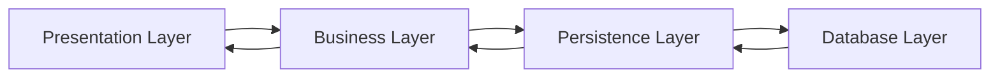

Spring Boot is a more user-friendly version of the Spring Framework. With Spring Boot, you can create autonomous and easy to run applications.

## What is deference between Spring and Spring Boot?

If you've ever tried to write a Java application time ago, you would have noticed how much work you had to do to perform database operations. It's a tiring process!

The Spring Framework simplifies these operations, thanks to the Spring JDBC module.

Spring is the combination of multiple sub-frameworks. It has many modules, for example, Spring MVC, Spring JDBC, Spring AOP, Spring ORM, and Spring Test. The core feature of the Spring Framework is Dependency Injection.

Even though Spring has made the development of Java applications easier, I think that it is vast and complicated to master. In the past, I tried to learn the Spring Framework from scratch, and I found it a long experience. This is where Spring Boot comes in handy, though. 😁

## What is Spring boot?

Spring Boot is built on top of the Spring Framework. It's a more automated and simplified version of Spring. Spring Boot makes it easy to create an up and running application in a few minutes. You go to [Spring Initializr](https://start.spring.io)

## Spring architecture

Spring Boot Architecture has four layers:

- **Presentation Layer**
- **Business Layer**
- **Persistence Layer**
- **Database Layer**

## **Presentation Layer**

This is the top layer of the architecture, responsible for:

- **Authentication**: Verifies user identity.
- **Data Conversion**: Transforms JSON data to objects and vice versa.
- **HTTP Request Handling**: Manages incoming REST API requests (GET, POST, PUT, DELETE, PATCH).
- **Delegating Authentication**: Transfers authentication tasks to the Business Layer.

The Presentation Layer is equivalent to the Controller class, which handles client requests.

## **Business Layer**

The Business Layer focuses on:

- **Validation**: Ensures data integrity.
- **Authorization**: Confirms user permissions.
- **Business Logic**: Implements the rules of the application.

This layer acts like the Service class, where essential business decisions are made. For instance, validation tasks are processed here.

The Business Layer communicates with both the Presentation and Persistence Layers.

## **Persistence Layer**

This layer is responsible for:

- **Storage Logic**: Manages data storage processes.
- **Data Translation**: Converts objects into database rows and vice versa.

It functions like the Repository interface, where database queries are defined. The Persistence Layer only interacts with the Business Layer and the Database Layer.

## **Database Layer**

This layer handles:

- **Database Operations**: Primarily CRUD operations.

It represents the actual database used in your application, where data is stored and managed.

## Spring boot workflow

Spring Boot workflow acts like this:

1. **The Client** makes an HTTP request.
2. **The Controller Class** receives the HTTP request.
3. The Controller understands what type of request will be processed, and then it deals with it.
4. If needed, it calls the **Service Class**.
5. The **Service Class** handles the business logic using data from the database.
6. If everything goes well, a JSP page is returned.

# Source

_This content is sourced from another author and holds significant value to me._ 😅

